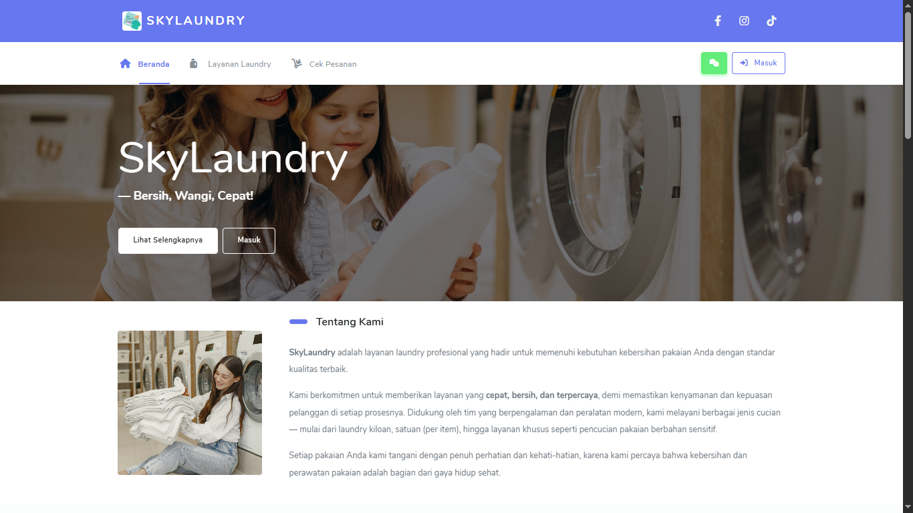
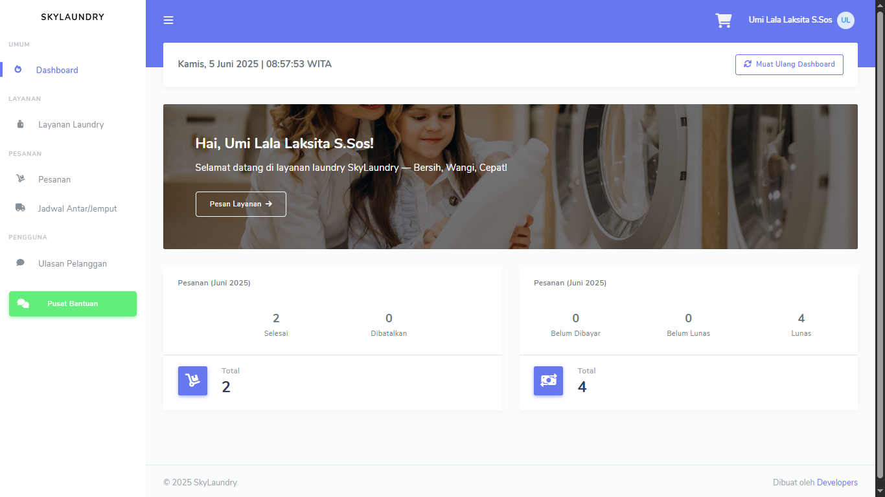
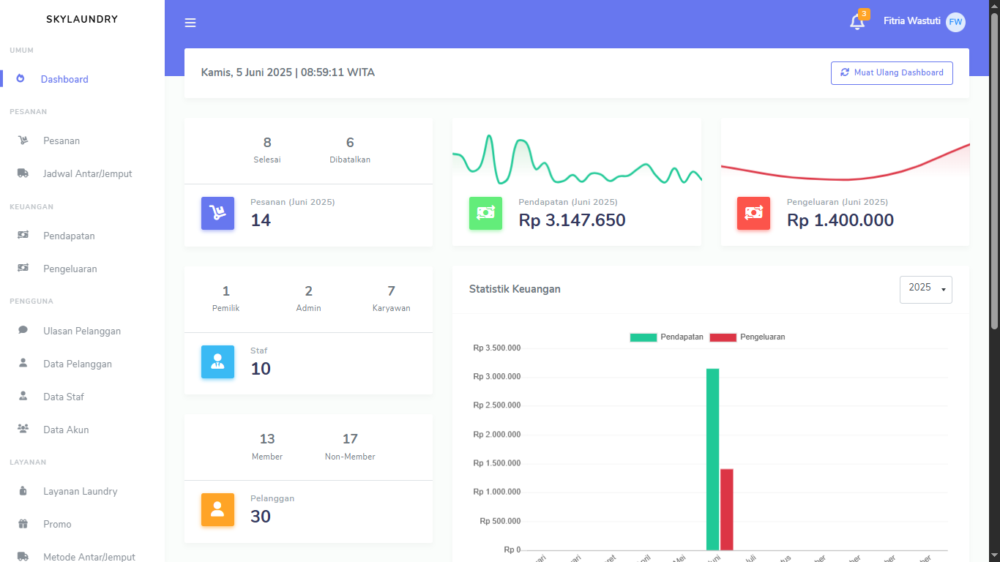

# Posyandu Project

Selamat datang di **Posyandu Project**! 🎉 Proyek ini dibangun menggunakan Laravel 12 dan template dashboard **Bootstrap Stisla**.

## 🖥️ Screenshot

1. Landing Page


2. Dashboard Customer


3. Dashboard Staff


## ✨ Fitur

- 🔐 **Login Multi-User**: Pelanggan, Karyawan, Admin, dan Pemilik Jasa Laundry.

- 📦 **Kelola Pesanan**: Akses semua role.

- 🚚 **Lihat Jadwal Antar/Jemput**: Akses semua role.

- 💬 **Kelola Ulasan & Kelola Data Pengguna (Data Pelanggan, Data Staf, dan Data Akun)**: Akses hanya untuk pelanggan, admin, dan pemilik.

- 👥 **Kelola Data Pengguna (Data Pelanggan, Data Staf, dan Data Akun)**: Akses hanya untuk admin dan pemilik.

- 📊 **Lihat Pendapatan dan Kelola Pengeluaran**: Akses hanya untuk admin dan pemilik.

- 🧺 **Kelola Data Layanan**: Akses hanya untuk admin dan pemilik.

- 🎁 **Kelola Promo**: Akses hanya untuk admin dan pemilik.

- 💳 **Kelola Metode Pembayaran**: Akses hanya untuk admin dan pemilik.

- 🚐 **Kelola Metode Antar/Jemput**: Akses hanya untuk admin dan pemilik.

- 🌐 **Kelola Identitas Situs**: Akses hanya untuk admin dan pemilik.

## 🚀 Teknologi yang Digunakan

-  **Laravel 12**: Framework PHP untuk membangun aplikasi web.
- **Boostrap Stisla**: Template dashboard responsif dan komponen UI base on **Boostrap 4**.

## 📦 Instalasi

### 📝 Prasyarat

Pastikan Anda telah menginstal:

- PHP >= 8.2
- Composer
- MySQL / MariaDB

Ikuti langkah-langkah berikut untuk menjalankan proyek Laravel **Posyandu** di servel lokal.

### 1. Clone Repository
Clone repositori dari GitHub ke direktori lokal:
```bash
git clone https://github.com/alfian742/e-laundry.git
```

### 2. Masuk ke Direktori Proyek
Pindah ke folder proyek:
```bash
cd e-laundry
```

### 3. Install Dependensi
Pastikan Anda sudah menginstall Composer. Lalu jalankan:
```bash
composer update
```

### 4. Konfigurasi File ENV
Laravel menggunakan file `.env` untuk konfigurasi lingkungan.

1. Duplikat file `.env.example` dan ubah namanya menjadi `.env`:
    ```bash
    cp .env.example .env
    ```

2. Buka file `.env` dan sesuaikan konfigurasi berikut:
    - `DB_DATABASE`: Nama database yang akan digunakan
    - `DB_USERNAME`: Username database
    - `DB_PASSWORD`: Password database
    - `APP_TIMEZONE`: Zona waktu aplikasi, sesuaikan dengan wilayah Anda (misalnya `Asia/Makassar`)

    Contoh:
    ```
    DB_DATABASE=e_laundry
    DB_USERNAME=root
    DB_PASSWORD=
    APP_TIMEZONE=Asia/Makassar
    ```

3. Generate application key:
    ```bash
    php artisan key:generate
    ```

### 5. Jalankan Migrasi dan Seeder
**Migrasi** digunakan untuk membuat struktur tabel database:
```bash
php artisan migrate
```

**Seeder** digunakan untuk mengisi data awal:
```bash
php artisan db:seed
```

### 6. Jalankan Aplikasi
Gunakan perintah berikut untuk menjalankan server development:
```bash
php artisan serve
```

Aplikasi akan berjalan di:
```
http://localhost:8000
```

---

## 📖 Panduan Penggunaan

1. **Login Admin**:
   - **Email**: `admin@gmail.com`
   - **Password**: `123`

2. **Login Karyawan**:
   - **Email**: `employee@gmail.com`
   - **Password**: `123`

3. **Login Pemilik**:
   - **Email**: `owner@gmail.com`
   - **Password**: `123`

4. **Login Pelanggan**:
   - **Email**: `user@gmail.com`
   - **Password**: `123`

3. **Kelola Semua Menu**:
   - Menu dapat dikelola oleh semua user dengan batasan akses tertentu.

---

Terima kasih telah mengunjungi repositori ini! Jika ada pertanyaan atau saran, jangan ragu untuk menghubungi saya.
